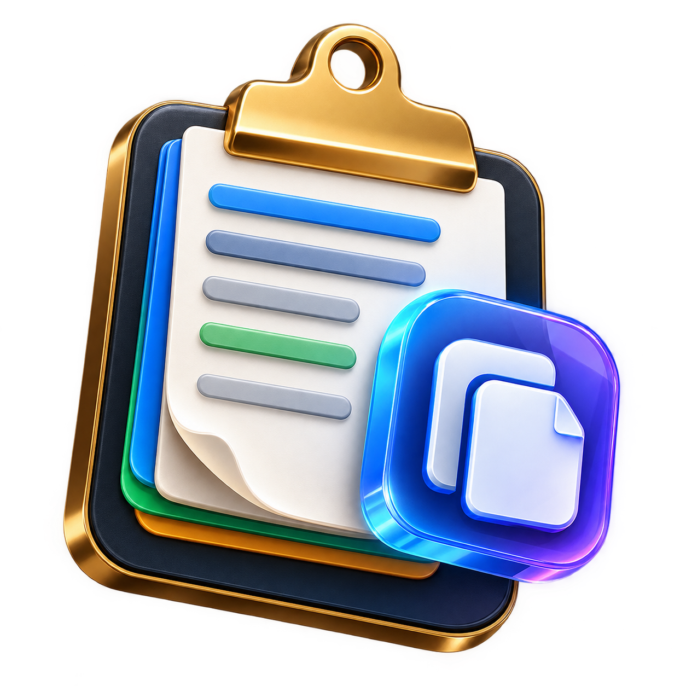

<div align="center">

  

  # ClipVault

  ### مدير الحافظة وخزينة كلمات المرور الذكية مع استخراج النصوص OneOCR لنظام Windows
  **The Ultra-Fast, Private & Beautiful Local-First Clipboard Manager & Password Vault with OneOCR Engine**

  [](https://github.com/yalaahamdy/ClipVault/releases)
  [](LICENSE)
  [](https://www.rust-lang.org/)
  [](https://tauri.app/)
  [](https://react.dev/)
  [](CONTRIBUTING.md)

  <p align="center">
    <a href="#-الميزات-الرئيسية">الميزات الرئيسية</a> •
    <a href="#-ما-الجديد-في-الإصدار-150">ما الجديد في v1.5.0</a> •
    <a href="#-جناح-الكتابة-الذكي-والتدقيق-اللغوي-smart-writing-suite">الكتابة والتدقيق</a> •
    <a href="#-محرك-استخراج-النصوص-oneocr">محرك OneOCR</a> •
    <a href="#-خزينة-كلمات-المرور-password-vault">خزينة كلمات المرور</a> •
    <a href="#-التحميل-والتثبيت">التحميل والتثبيت</a> •
    <a href="#-الاختصارات-السريعة">الاختصارات</a>
  </p>

</div>

---

## 📖 نبذة عن المشروع (About ClipVault)

**ClipVault** هو تطبيق سطح مكتب متكامل، فائق السرعة، وخفيف للغاية مخصص لنظامي Windows 10 و 11. يجمع بين:
1. **مدير حافظة ذكي متعدد الوسائط**: يسجل النصوص، الأكواد، الروابط، الصور، والملفات بدون أي استهلاك ملحوظ للعتاد.
2. **جناح الكتابة الذكي والتدقيق الشامل (Smart Writing Suite)**: يحل مشكلة نسيان تبديل لغة لوحة المفاتيح في أي تطبيق فوراً، مع مدقق إملائي احترافي، كتابة صوتية، وتوقع للكلمات.
3. **تصوير الشاشة والتعرف الضوئي (Region Screenshot → OCR)**: تجميد الشاشة وقص أي منطقة واستخراج نصوصها لحظياً بمحرك OneOCR المدمج محلياً 100%.
4. **محرك OneOCR Professional المدمج محلياً**: يستخرج النصوص العربية والإنجليزية من الصور ولقطات الشاشة في أجزاء من الثانية دون إنترنت.
5. **خزينة كلمات مرور مشفرة بتشفير عسكري AES-256-GCM**: تحمي بيانات تسجيل الدخول وبطاقات الدفع والملاحظات السرية محلياً 100%.
6. **دعم ثنائي اللغة بالكامل (Bilingual i18n)**: واجهة عربية وإنجليزية كاملة مع انعكاس تلقائي (RTL ⇄ LTR) بضغطة زر.

تم بناء التطبيق باستخدام **Tauri v2** و **Rust** مع واجهة تفاعلية حديثة بـ **React 18 + TypeScript** لتقديم سرعة استجابة مذهلة واستهلاك ذاكرة متواضع جداً (~15 إلى 35 ميجابايت).

> [!NOTE]
> **محلي 100% (Zero-Knowledge & Local-First):** لا يتصل التطبيق بأي خوادم خارجية ولا يرسل أي بيانات عبر الإنترنت. جميع نصوصك وصورك وكلمات مرورك مخزنة ومشفرة محلياً على جهازك فقط.

---

## 🆕 ما الجديد في الإصدار 1.5.0 (What's New in v1.5.0)

| الميزة | التفاصيل والإمكانيات |
| :--- | :--- |
| ✂️ **لقطة شاشة وقص أي منطقة → استخراج النص فورياً** | اضغط <kbd>Ctrl</kbd>+<kbd>Shift</kbd>+<kbd>S</kbd> في أي مكان في ويندوز لتجميد الشاشة وتحديد أي منطقة؛ يتم حفظ اللقطة وتمريرها لمحرك OneOCR واستخراج النص منها ونسخه تلقائياً للحافظة مع حماية فائقة ضد أي تعطل. |
| ⚡ **18 عملية تحويل سريعة للنصوص (Quick Transforms)** | النقر بزر الفأرة الأيمن على أي نص يتيح: تبديل حالة الأحرف (UPPER / lower / Title / Sentence)، تنظيف وضغط السطور، إزالة الفراغات المكررة، الترتيب الأبجدي، تنسيق وضغط JSON، ترميز وفك URL وBase64، تنظيف وسوم HTML، وإزالة التشكيل العربي. |
| 📱 **توليد ومشاركة رموز QR دون إنترنت (QR Code Sharing)** | توليد رمز QR محلي عالي الدقة لأي نص أو رابط فوراً، مع إمكانية نسخ الرمز كصورة أو تنزيله بصيغة PNG. |
| 📑 **التحديد المتعدد واللصق المتسلسل والدمج (Multi-Select & Merge)** | تحديد عناصر متعددة، لصقها تتابعياً واحداً تلو الآخر (<kbd>Sequential Paste</kbd>)، أو دمجها في نص واحد مع فاصل مخصص ومعاينة مباشرة. |
| 🌐 **واجهة ثنائية اللغة بالكامل (العربية ⇄ English)** | ترجمة شاملة لكافة أجزاء التطبيق والتبديل الفوري عبر <kbd>Ctrl</kbd>+<kbd>L</kbd> أو الإعدادات، مع انعكاس كامل وسلس للواجهة (RTL ⇄ LTR) والخطوط والتواريخ. |
| 🎛️ **إعادة بناء التبويبة الرئيسية (Mobile-First 3D Hub)** | تصميم متناسق مريح جداً للنوافذ المنبثقة الصغيرة، شارة مراقب تفاعلية بنبض حي، بطاقة أحدث عنصر منسوخ مع زر نسخ فوري، وكبسولة إحصائيات مصغرة. |

---

## ✨ الميزات الرئيسية (Key Features)

| التصنيف | المزايا والإمكانيات |
| :--- | :--- |
| ✍️ **جناح الكتابة الذكي (Smart Typing Suite)** | تصحيح نصوص لغة لوحة المفاتيح المعكوسة تلقائياً، تصحيح التحديد في أي نافذة نشطة، مدقق إملائي وقواعدي فائق، إملاء صوتي، وتوقع الكلمات. |
| ✂️ **أداة قص الشاشة والتعرف الضوئي (Snip → OCR)** | اختصار <kbd>Ctrl</kbd>+<kbd>Shift</kbd>+<kbd>S</kbd> لتحديد أي جزء على الشاشة واستخراج نصوصه فوراً بمحرك OneOCR. |
| 🔍 **محرك OneOCR لاستخراج النصوص** | استخراج النصوص والتعرف الضوئي عالي الدقة محلياً في أقل من 500 ميلي ثانية، مع دعم تام للغة العربية والإنجليزية، وتأثير مسح ليزري ثلاثي الأبعاد. |
| 🔎 **البحث في نصوص الصور** | إمكانية البحث المباشر في شريط البحث الرئيسي عن أي نص موجود داخل الصور المنسوخة دون الحاجة لفتحها! |
| 🔐 **خزينة كلمات المرور (Vault)** | تشفير عسكري AES-256-GCM، قفل برمز PIN رئيسي، تدقيق أمني لكلمات المرور الضعيفة والمكررة، واستيراد وتصدير ملفات Chrome CSV بنقرة واحدة. |
| ⚡ **الأداء الفائق والتلقائية** | مراقبة فورية لتغيرات الحافظة عبر Windows API بدون استهلاك معالج (<0.1% CPU)، ودعم اللصق التلقائي الفوري (`Auto-Paste`). |
| 🎯 **تعدد الصيغ والتصنيف** | دعم كامل للنصوص، الأكواد، الروابط، الصور، والملفات، مع وسوم ملونة ومجموعات Collections وفرز زمني وحسب التطبيق المصدر وحجم النص. |
| 🎨 **تصميم ثلاثي الأبعاد عصري** | واجهة زجاجية بنمط Acrylic، بطاقات بارزة غير منكمشة، شريط تنقل فرعي قابل للتمرير بعجلة الفأرة، وتأثيرات ضوئية تفاعلية. |
| 🛡️ **خصوصية صارمة ومسح أمني** | مسح تلقائي لكلمات المرور المنسوخة من الحافظة بعد 30 ثانية، قائمة استثناء للتطبيقات الحساسة، وحجب المحتوى الحساس. |

---

## ✍️ جناح الكتابة الذكي والتدقيق اللغوي (Smart Writing Suite)

يحل ClipVault أشهر مشاكل الكتابة وأكثرها إحباطاً لمستخدمي نظام Windows من خلال جناح ذكي متكامل:

### 1. 🔄 عكس لغة لوحة المفاتيح اللحظي (Keyboard Layout Inverter)
- **حل مشكلة نسيان تبديل اللغة (Alt+Shift)**: عندما تكتب نصاً طويلاً وتتفاجأ أنك كنت تكتب بحروف لغة أخرى مثل:
  - `hghsjo]hl` ➔ يتحول بضغطة زر إلى `الاستخدام`.
  - `صصصزلخخلمثزؤخة` ➔ يتحول تلقائياً إلى `www.google.com`.
  - `ClipVault` ➔ يتحول إلى `زمهحثفعمف`.
- **تصحيح النص المحدد في أي تطبيق نشط (System-Wide Active Selection Fixer)**:
  - فقط ظلل النص في أي برنامج (Word, Chrome, Notepad, Discord, VS Code...) واضغط على <kbd>Ctrl</kbd>+<kbd>Shift</kbd>+<kbd>X</kbd> وسيقوم ClipVault بنقل النص فوراً للتدقيق والتصحيح!

### 2. 🪄 المدقق الإملائي واللغوي الاحترافي الشامل (Pro Morphological Spell Checker)
- **محرك لغوي صرفي متقدم**: تفكيك السوابق واللواحق الصرفية، فحص جذع الكلمة، وخوارزمية مسافة ليفنشتاين لكشف الأخطاء الطباعية بدقة فائقة.
- **تصحيح متقدم للهمزات**: همزات القطع وهمزات الوصل التلقائية في الخماسي والسداسي.
- **التاء المربوطة والهاء**: قواعد اشتقاقية دقيقة مع استثناء صارم للكلمات ذات الهاء الأصلية (مياه، فواكه، توجيه).
- **الألف المقصورة والياء**: تصحيح الكلمات المقصورة والزوائد (إلى، على، حتى، مستشفى، أخرى).
- **التنوين مقابل النون الساكنة**: معالجة معجمية ممتدة (شكراً وليس شكرن، عفواً وليس عفون).
- **مؤشر دقة وسلامة النص (Text Accuracy Meter)** مع زر السحر لتصحيح كافة الأخطاء دفعة واحدة بنقرة واحدة (<kbd>Ctrl</kbd>+<kbd>Enter</kbd>).

### 3. 🎙️ استوديو الإملاء الصوتي والنطق (Voice Studio & TTS)
- **تفريغ صوتي فوري عالي الدقة**: تحدث عبر الميكروفون باللغة العربية (فصحى أو لهجات) أو الإنجليزية ليتم تحويل صوتك إلى نص مكتوب بسرعة ودقة فائقة.
- **محاكي نبضات وأمواج صوتية حية (Audio Visualizer)** مع عداد زمني للتسجيل.
- **ضخ النص المباشر (Inject into Active App)**: نقل ولصق النص المفرغ صوتياً إلى البرنامج المفتوح لديك فوراً عبر اختصار <kbd>Shift</kbd>+<kbd>Enter</kbd>.

---

## 🔍 محرك استخراج النصوص (OneOCR Professional Engine)

تم دمج محرك **OneOCR Professional** المتقدم المبني على تقنيات الذكاء الاصطناعي لـ Microsoft OneOCR للعمل محلياً بصمت وسرعة قياسية:

- **استخراج فوري فائق الدقة**: استخراج النصوص والأسطر ومربعات الإحاطة في أقل من نصف ثانية دون اتصال بالإنترنت.
- **تكامل تام مع أداة قص الشاشة (`Ctrl+Shift+S`)**: حدد أي منطقة على شاشتك ليتم قراءتها واستخراج نصوصها فوراً.
- **البحث داخل نصوص الصور**: يمكنك البحث في شريط البحث عن الكلمات الموجودة داخل الصور الملتقطة والمنسوخة.
- **شاشة المعاينة الفائقة**: تبويبة مزدوجة للصورة والنص المستخرج، مع مؤشر ليزر ثلاثي الأبعاد وإحصائيات الكلمات والأحرف.

---

## 🔐 خزينة كلمات المرور (Professional Password Vault)

يوفر ClipVault خزينة متكاملة لحفظ وإدارة كلمات المرور بأعلى معايير الأمان العالمية:

1. **تشفير عسكري AES-256-GCM**: اشتقاق المفتاح الرئيسي باستخدام 10,000 جولة من خوارزمية SHA-256 مع Salt عشوائي فريد.
2. **قفل برمز PIN ذكي**: قفل رئيسي برمز PIN مع إمكانية القفل اليدوي أو التلقائي عند الخمول.
3. **استيراد وتصدير Chrome Passwords CSV**: توافق 100% مع متصفحات: Google Chrome, Microsoft Edge, Brave, و Opera.
4. **فحص وتدقيق الأمان (Security Audit)**: تنبيهك بكلمات المرور الضعيفة والمكررة بنقرة واحدة.
5. **مولد كلمات مرور احترافي** و **مسح أمني تلقائي للحافظة بعد 30 ثانية**.

---

## ⌨️ الاختصارات السريعة (Keyboard Shortcuts)

| الاختصار | الإجراء |
| :--- | :--- |
| <kbd>Ctrl</kbd> + <kbd>Shift</kbd> + <kbd>V</kbd> | فتح أو إخفاء الحافظة من أي مكان في النظام |
| <kbd>Ctrl</kbd> + <kbd>Shift</kbd> + <kbd>S</kbd> | **تجميد الشاشة وقص أي منطقة لاستخراج نصها فوراً (Snip → OCR)** |
| <kbd>Ctrl</kbd> + <kbd>Shift</kbd> + <kbd>X</kbd> | **سحب النص المحدد في أي برنامج على مستوى Windows وتدقيقه فوراً** |
| <kbd>Ctrl</kbd> + <kbd>L</kbd> | **التبديل الفوري بين واجهة اللغة العربية والإنجليزية (i18n)** |
| <kbd>Ctrl</kbd> + <kbd>1</kbd> | الانتقال إلى الشاشة الرئيسية (Home) |
| <kbd>Ctrl</kbd> + <kbd>2</kbd> | الانتقال إلى سجل الحافظة (Clipboard) |
| <kbd>Ctrl</kbd> + <kbd>3</kbd> | الانتقال إلى خزينة كلمات المرور (Password Vault) |
| <kbd>Ctrl</kbd> + <kbd>4</kbd> | الانتقال إلى جناح الكتابة الذكي والتدقيق (Smart Typing) |
| <kbd>Ctrl</kbd> + <kbd>5</kbd> | الانتقال إلى شاشة الإعدادات |
| <kbd>Enter</kbd> | نسخ العنصر المحدد ولصقه تلقائياً وإخفاء النافذة |
| <kbd>Space</kbd> | فتح نافذة المعاينة الشاملة للعنصر المحدد |
| <kbd>Ctrl</kbd> + <kbd>T</kbd> | تبديل مظهر الواجهة (داكن / فاتح) |
| <kbd>Ctrl</kbd> + <kbd>Shift</kbd> + <kbd>N</kbd> | فتح لوحة إدارة الوسوم والمجموعات |
| <kbd>Esc</kbd> | إغلاق النوافذ المنبثقة أو إلغاء لقطة الشاشة أو إخفاء الحافظة |

---

## 🚀 التحميل والتثبيت (Download & Install)

يمكنك تحميل أحدث نسخة مستقرة لنظام Windows 64-bit مباشرة من صفحة [Releases](https://github.com/yalaahamdy/ClipVault/releases):

| الملف | المنصة | الحجم | رابط التحميل |
| :--- | :---: | :---: | :--- |
| **`ClipVault_1.5.0_x64-setup.exe`** | Windows 10 / 11 (x64) | **184.5 MB** | [**تحميل مباشر (Direct Download)**](https://github.com/yalaahamdy/ClipVault/releases/download/v1.5.0/ClipVault_1.5.0_x64-setup.exe) |

> **ملاحظة حول Windows SmartScreen:** نظراً لأن الحزمة مفتوحة المصدر ومبنية محلياً دون شهادة توقيع مدفوعة، قد يظهر تحذير أمان خفيف عند أول تشغيل؛ اضغط على *"More info"* ثم *"Run anyway"*. الكود المصدري متاح بالكامل للمراجعة.

---

## 🛠️ البناء من المصدر (Building from Source)

```bash
# 1. استنساخ المستودع
git clone https://github.com/yalaahamdy/ClipVault.git
cd ClipVault

# 2. تثبيت مكتبات الواجهة
npm install

# 3. تشغيل وضع التطوير الحي
npm run tauri dev

# 4. تجميع مثبت الإنتاج النهائي (NSIS)
npm run tauri build
```

ينتج ملف التثبيت المجمع في المسار:
`src-tauri/target/release/bundle/nsis/ClipVault_1.5.0_x64-setup.exe`

---

## 📄 الترخيص (License)

هذا المشروع مرخص تحت رخصة **MIT** — راجع ملف [LICENSE](LICENSE) لمزيد من التفاصيل.

<div align="center">
  <sub>صُنع بكل حب وإتقان ليكون أسرع وأجمل مدير حافظة وخزينة أمان لنظام Windows 💙</sub>
</div>
